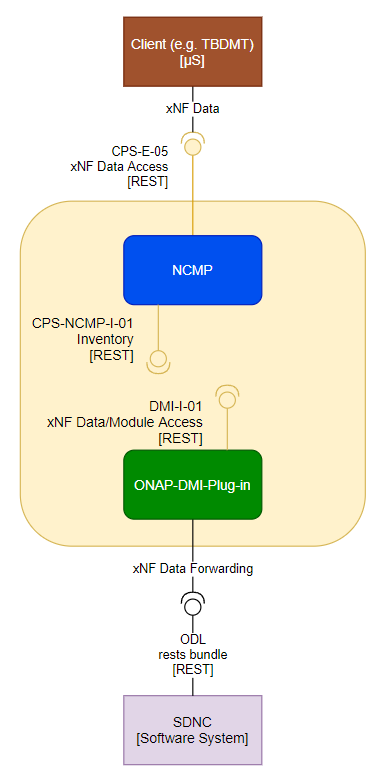

.. This work is licensed under a Creative Commons Attribution 4.0 International License.
.. http://creativecommons.org/licenses/by/4.0
.. Copyright (C) 2021-2024 Nordix Foundation
.. _architecture:

DMI-Plugin Architecture
#######################

.. toctree::
   :maxdepth: 1

High Level Component Definition and Architectural Relationships
===============================================================

The DMI-Plugin provides a gateway for registration and syncing of CM Handles within CPS.

API definitions
===============

The DMI-Plugin provides following interfaces.

.. list-table::
   :header-rows: 1

   * - Interface name
     - Interface definition
     - Interface capabilities
     - Protocol
   * - CPS-E-05
     - Provides external clients with  xNF data access and module information
     - - Create data
       - Delete data
       - Update data
       - Read data
       - Query data
       - Query module references
     - REST
   * - CPS-NCMP-I-01
     - DMI-Plugin Inventory
     - - Register Plug-in CM-Handles
       - Health Check API
     - REST
   * - DMI-I-01
     - Provides NCMP with  xNF data access and module information
     - - Create data
       - Delete data
       - Update data
       - Read data
       - Query data
       - Query module references
     - REST
   * - DMI-I-02
     - Provides support for Async Data Subjobs
     - - Subnetwork-wide create
       - Subnetwork-wide read
       - Subnetwork-wide update
       - Subnetwork-wide delete
       - Subnetwork-wide action
       - Subnetwork-wide query
     - REST

More details on the CPS interface CPS-E-05 which is responsible for the DMI-Plugin can be found on the :ref:`CPS Architecture page<onap-cps:architecture>`
