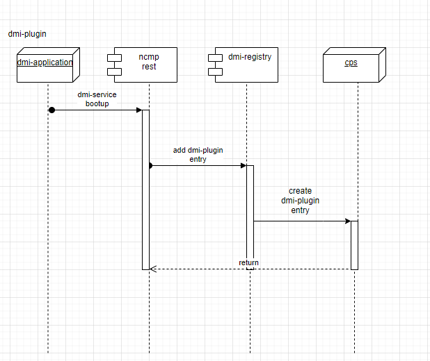

.. This work is licensed under a Creative Commons Attribution 4.0 International License.
.. http://creativecommons.org/licenses/by/4.0
.. Copyright (C) 2021 Nordix Foundation
.. _architecture:

DMI Plugin Architecture
#######################

.. warning:: draft

.. toctree::
   :maxdepth: 1

High Level Component Definition and Architectural Relationships
===============================================================

The DMI plugin provides a gateway for registration and syncing of CM Handles within CPS

Project implementation proposal page describing scope is here:
`CPS-390 Spike: Define and Agree DMI Plugin REST Interface <https://wiki.onap.org/display/DW/CPS-390+Spike%3A+Define+and+Agree+DMI+Plugin+REST+Interface>`_

This page reflects the state for Istanbul-R9 release.

API definitions
===============

The DMI plugin provides following interfaces.

.. list-table::
   :header-rows: 1

   * - Interface name
     - Interface definition
     - Interface capabilities
     - Protocol
   * - DMI-E-01
     - Administrative Data Management
     - - write data for a CM-Handle
     - REST
   * - DMI-E-02
     - Generic Data Access
     - - get resource data from passthrough-operational for cm handle
       - get resource data from passthrough-running for cm handle
     - REST
   * - DMI-E-03
     - Generic Data Search
     - - get all modules for cm handle by cm handle id
       - retrieve all module resources by cm handle id
     - REST

The DMI plugin Basic Concepts are described in :doc:`modeling`.
